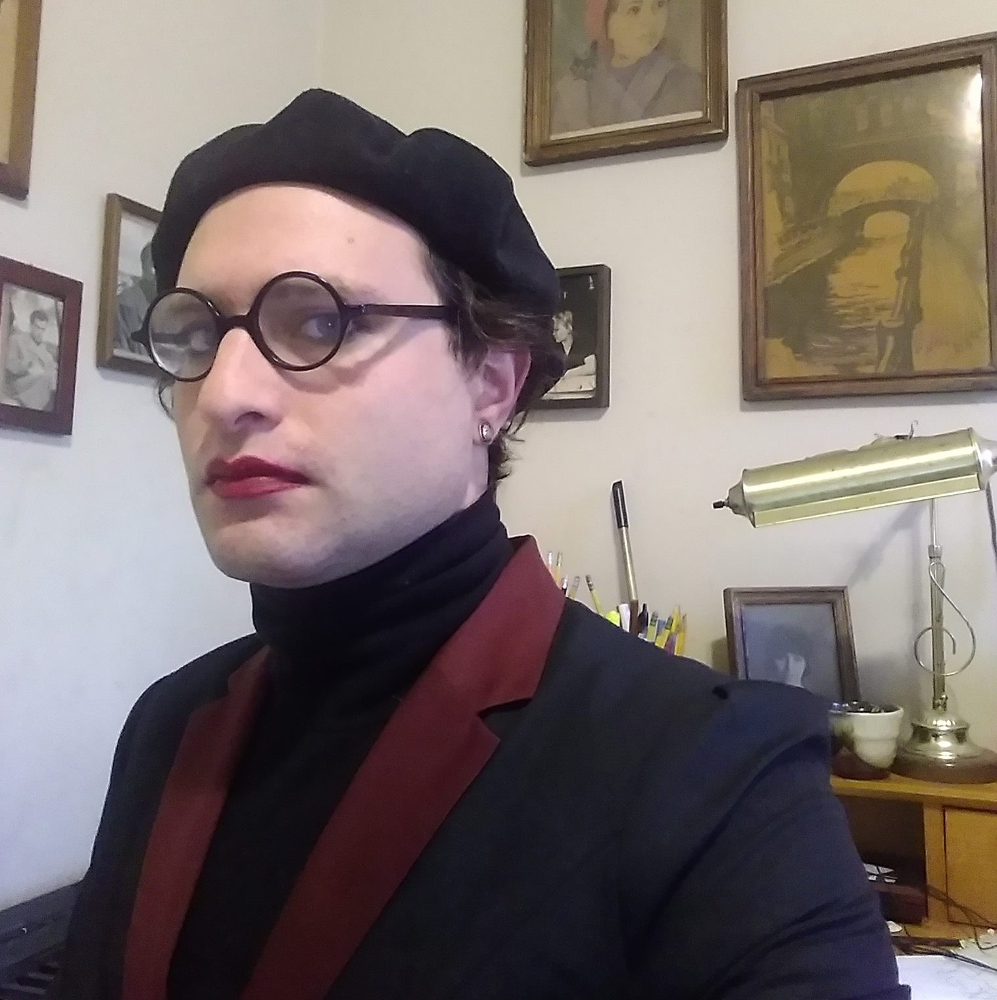

{inline u-photo} <a href="https://jl-feinstein.jews.international" class="p-name u-url" rel="me">JL Feinstein</a> was born in the Former Soviet Union into a Jewish family. They are an Israeli citizen, having grown up in Palestine. Currently, JL lives in the United States. They are a parent, a student, a Hebrew teacher, an organizer, and an aspiring poet. This is their personal website, so expect the quality of content to vary. If you enjoy it, or it elicits a different reaction, please use the social media links above to let them know, or email him at <a href="mailto:derpayatz@gmail.com" rel="me">derpayatz@gmail.com</a>
{: .h-card}
